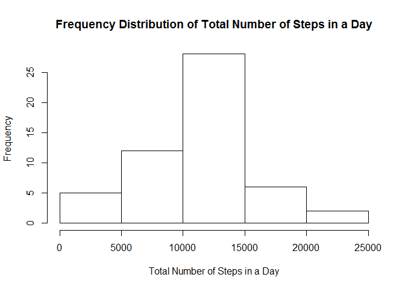
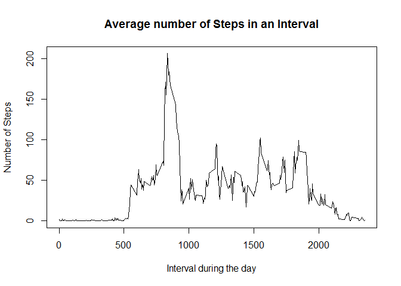
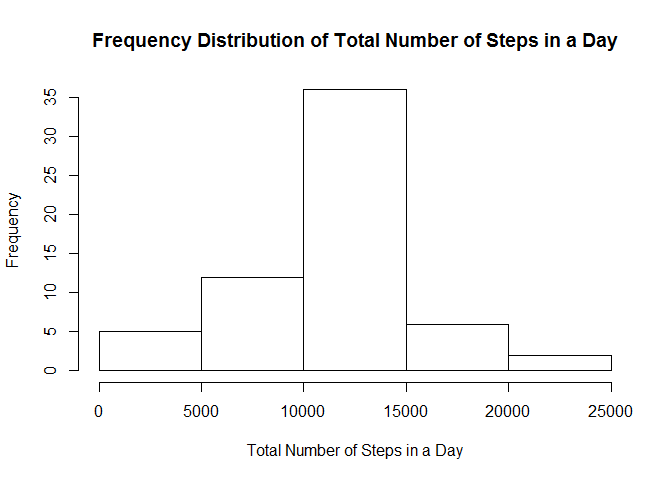

# Reproducible Research: Peer Assessment 1


## Loading and preprocessing the data

The below code is used to load the data


```r
download.file(url="https://d396qusza40orc.cloudfront.net/repdata%2Fdata%2Factivity.zip", destfile="assign1.zip", mode="wb")
unzip("assign1.zip")
list.files()
activity<-read.csv("activity.csv",nrows=100)
head(activity)
str(activity)
activity<-read.csv("activity.csv",na.strings = "NA", colClasses = c("numeric","Date","numeric"),stringsAsFactors = F)
```


## What is mean total number of steps taken per day?

the total number of steps follows the following distribution

```r
totStepsByDay<-tapply(activity$steps,activity$date,sum)
```


```r
hist(totStepsByDay)
```

 


```r
mean1<-mean(totStepsByDay,na.rm=T)
median1<-median(totStepsByDay,na.rm=T)
print(paste("The mean total number of steps taken per day is ",mean1))
```

```
## [1] "The mean total number of steps taken per day is  10766.1886792453"
```

```r
print(paste("The median total number of steps taken per day is ",median1))
```

```
## [1] "The median total number of steps taken per day is  10765"
```


## What is the average daily activity pattern?


```r
avgStepsByInterval<-tapply(activity$steps,activity$interval,mean,na.rm=T)
plot(names(avgStepsByInterval),avgStepsByInterval,type="l")
```

 

```r
maxInterval<-names(avgStepsByInterval[avgStepsByInterval==max(avgStepsByInterval)])
print(paste("the max no of steps are contained in interval ",maxInterval))
```

```
## [1] "the max no of steps are contained in interval  835"
```


## Imputing missing values

Missing values are imputed in following code taking mean daily activity pattern for the interval

```r
naRows<-is.na(activity$steps)
totNaRows<-sum(naRows)
print(paste("Total number of missing values is ",totNaRows))
```

```
## [1] "Total number of missing values is  2304"
```

```r
naIntervals<-activity$interval[naRows]
activity2<-activity
activity2$steps[naRows]<-avgStepsByInterval[as.character(naIntervals)]
```


Post imputation tot steps looks like below:
the total number of steps follows the following distribution

```r
totStepsByDay2<-tapply(activity2$steps,activity$date,sum)
```

```r
hist(totStepsByDay2)
```

 


```r
mean2<-mean(totStepsByDay2,na.rm=T)
median2<-median(totStepsByDay2,na.rm=T)

print(paste("The mean total number of steps taken per day is ",mean2))
```

```
## [1] "The mean total number of steps taken per day is  10766.1886792453"
```

```r
print(paste("The median total number of steps taken per day is ",median2))
```

```
## [1] "The median total number of steps taken per day is  10766.1886792453"
```


mean stays the same but median is different

## Are there differences in activity patterns between weekdays and weekends?

code for this is:
```r{}
findWeekend<-function(x){
    if (weekdays(x) == "Saturday" || weekdays(x)=="Sunday") "weekend" 
    else "weekday"
}
wd<-factor(sapply(activity2$date,findWeekend))
activity2<-cbind(activity2,wd)
library(lattice)
xyplot(steps ~ interval | wd2, data = activity3, layout = c(1,2),type="l")
```
